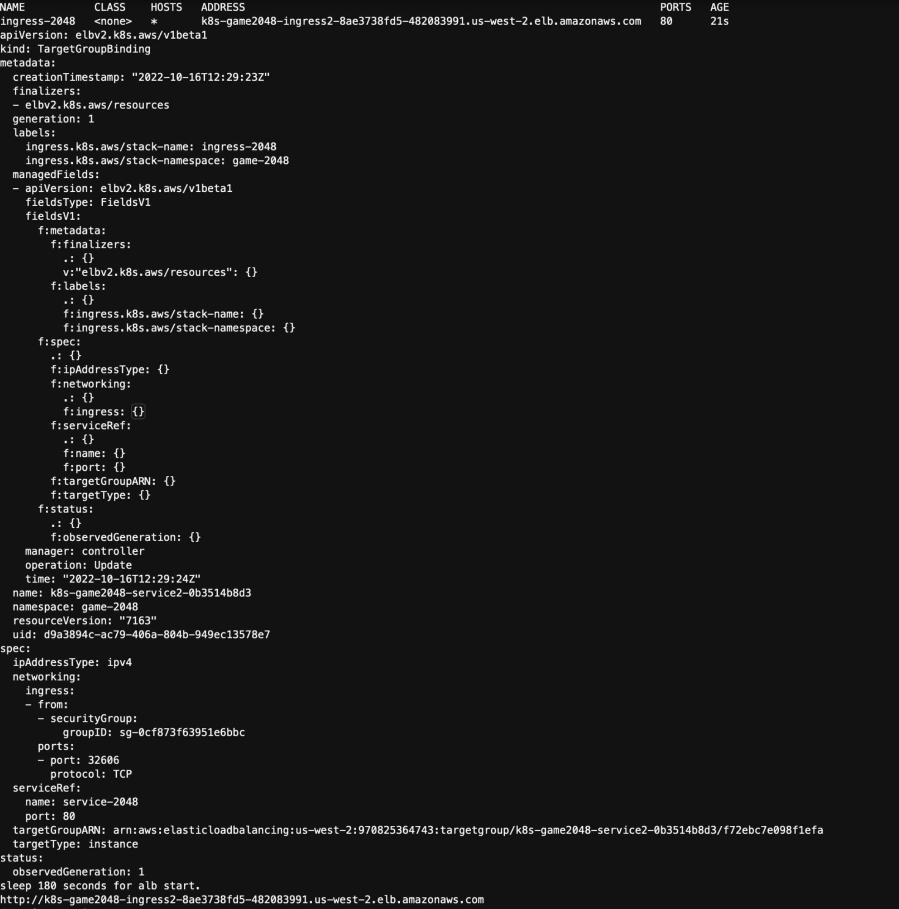

## 1. Install alb controller (about 5 mins)
* Use command to check helm is installed.
```bash
helm version --short
```
If helm is not installed, use the following command to install it first.
```bash
. ~/environment/eksworkshopguide/eks-helm.sh
```
After install helm, you can install alb ingress controller.
```bash
. ~/environment/eksworkshopguide/eks-ingress-alb.sh

```
Install ingress alb controller.
[eks-ingress-alb](./eks-ingress-alb.sh)
* Install Helm and all the dependencies will take approximately 5 minutes


## 2.Deploy game 2048.
*Run the command.
```bash
. ~/environment/eksworkshopguide/eks-ingress-alb-2048.sh

```
* You can see the console print alb url, paste the url in the browser to enjoy your game.
* **<font color=#FF0000>ABL provision will use 2-3 minutes to complete</font>**

