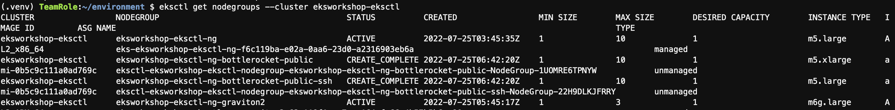
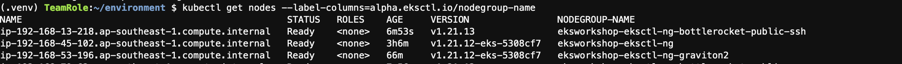

## 1.Create a bottlerocket unmanaged nodegroup.
* runt the following command to setup a bottlerocket unmanaged nodegroup.
```bash
. eksworkshopguide/eks-workshop-bottlerocket.sh

```
[eks-workshop-bottlerocket.sh](./eks-workshop-bottlerocket.sh)
* create bottlerocket nodegroups and all the dependencies will take approximately 10 minutes

* Check the added nodegroup
```bash
eksctl get nodegroups --cluster eksworkshop-eksctl

```


* Check the node in the cluster.
```bash
kubectl get nodes --label-columns=alpha.eksctl.io/nodegroup-name

```



