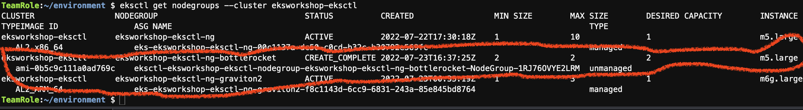
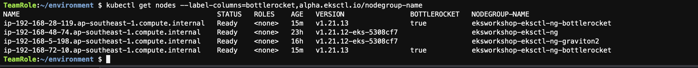

##1.Create a bottlerocket unmanaged nodegroup.
* runt the following command to setup a bottlerocket unmanaged nodegroup.
```bash
. eksworkshopguide/eks-workshop-bottlerocket.sh

```
* Launching EKS and all the dependencies will take approximately 10 minutes

* check the bottlerocket nodegroup status.


* check the bottlerocket node status.

