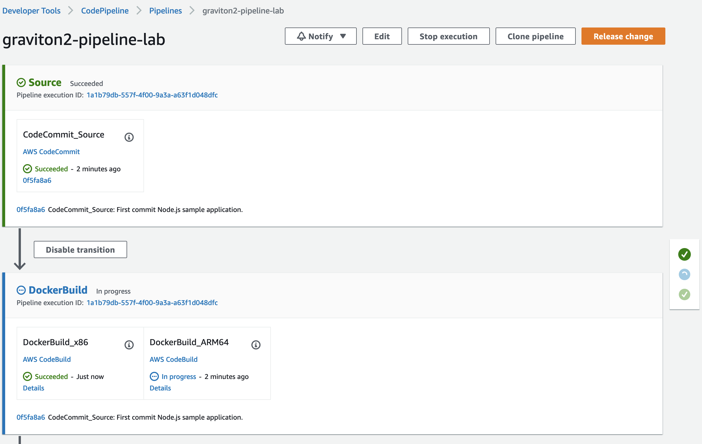

## 1. Create Multi-Arch Docker file (about 20 mins)
```bash
. ~/environment/eksworkshopguide/eks-graviton2-cicd.sh

```
[eks-graviton2-cicd](./eks-graviton2-cicd.sh)
* Clone the Repo from Graviton workshop https://github.com/aws-samples/graviton2-workshop 
* Create the CodePipeline.
* Commit the code to trigger Codepipeline.
* Monitor CodePipeline steps using AWS Console by opening this link in a new tab. https://ap-southeast-1.console.aws.amazon.com/codesuite/codepipeline/pipelines/graviton2-pipeline-lab/view?region=ap-southeast-1


* **<font color=#FF0000>Wait all steps of CodePipeline are successful</font>**
* check the repository images at https://ap-southeast-1.console.aws.amazon.com/ecr/repositories?region=ap-southeast-1
  
## 2.Modify the app, and trigger the cicd to build new images.
*Run the command.
```bash
sed -i 's/Hi/Hi EKS User/g' ~/environment/graviton2-workshop/graviton2-pipeline-lab/nodejs_code/app.js
cd ~/environment/graviton2-workshop/graviton2-pipeline-lab
git add .
git commit -m "First commit Node.js sample application."
git push

```
* You can check the CodePipeline is running again. https://ap-southeast-1.console.aws.amazon.com/codesuite/codepipeline/pipelines/graviton2-pipeline-lab/view?region=ap-southeast-1
* **<font color=#FF0000>Wait all steps of CodePipeline are successful</font>**
* check the repository images at https://ap-southeast-1.console.aws.amazon.com/ecr/repositories?region=ap-southeast-1