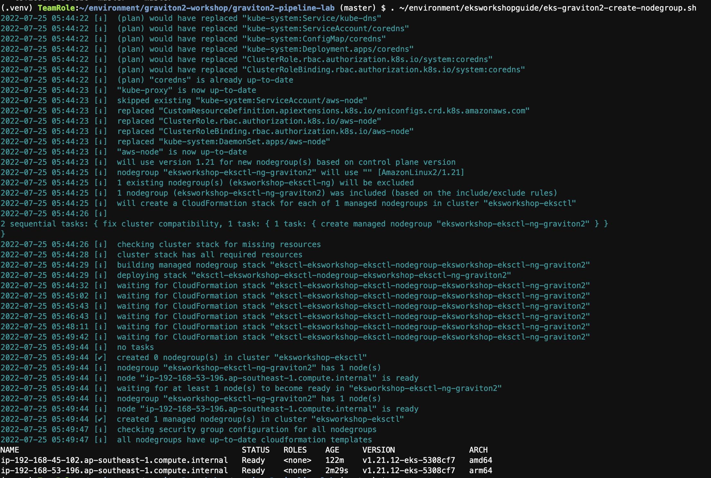
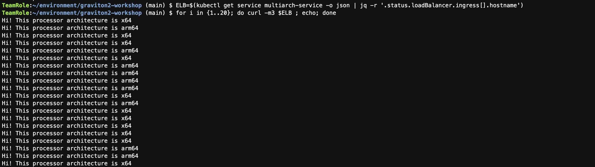

## 1.Create the graviton node group (10mins).
```bash
. ~/environment/eksworkshopguide/eks-graviton2-create-nodegroup.sh

```
* Please use the following code to check the node arch.
```bash
kubectl get nodes --label-columns=kubernetes.io/arch

```
[eks-graviton2-create-nodegroup.sh](./eks-graviton2-create-nodegroup.sh)
* New arm64 node was added to the cluster.


## 2.Deploy the sample application on arm64 and x86
```bash
. ~/environment/eksworkshopguide/eks-graviton2-deploy.sh

```
* deploy the application on both x86 and arm64(Graviton)
* use the following command to see the service status, and get the EXTERNAL-IP to access the service after the NLB is active. https://ap-southeast-1.console.aws.amazon.com/ec2/v2/home?region=ap-southeast-1#LoadBalancers:sort=loadBalancerName
```bash
kubectl get svc

```
[eks-graviton2-deploy.sh](./eks-graviton2-deploy.sh)

## 3.Check the deployment status
* use the following command to check access pod arch as screen show as below.
```bash
ELB=$(kubectl get service multiarch-service -o json | jq -r '.status.loadBalancer.ingress[].hostname')
for i in {1..20}; do curl -m3 $ELB ; echo; done

```
