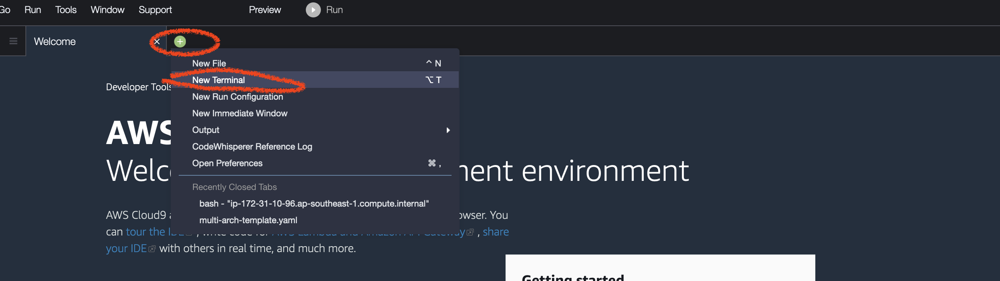

## 1.Create Role:
* Click https://us-east-1.console.aws.amazon.com/iam/home#/roles$new?step=type&commonUseCase=EC2%2BEC2&selectedUseCase=EC2&policies=arn:aws:iam::aws:policy%2FAdministratorAccess&roleName=eksworkshop-admin 
* Confirm that AWS service and EC2 are selected, then click Next: Permissions to view permissions.
* Confirm that AdministratorAccess is checked, then click Next: Tags to assign tags.
* Take the defaults, and click Next: Review to review.
* Enter eksworkshop-admin for the Name, and click Create role.

## 2.Launch Cloud9 in your closest region:
* Click https://ap-southeast-1.console.aws.amazon.com/cloud9/home/create
* Name it eksworkshop, click Next.
* Choose Other instance type, and select t3.medium for instance type, take all default values and click Create environment

## 3.Launch a EKS with Nodegroups
* Open a new Terminal in Cloud9. and run 


```bash
git clone https://github.com/FrankieCheng/eksworkshopguide
chmod +755 eksworkshopguide/*.sh
. eksworkshopguide/eks-workshop-create-cluster.sh

```
[eks-workshop-create-cluster](./eks-workshop-create-cluster.sh)

* Launching EKS and all the dependencies will take approximately 25 minutes
* You can test the EKS cluster and nodes in console or use bash, if we see our 1 node, we know we have authenticated correctly
```bash
kubectl get nodes

```