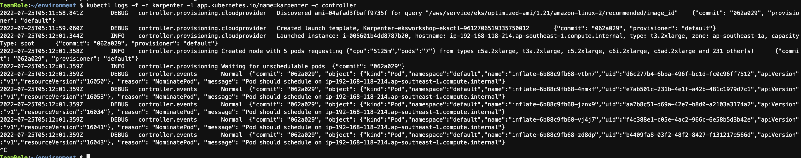
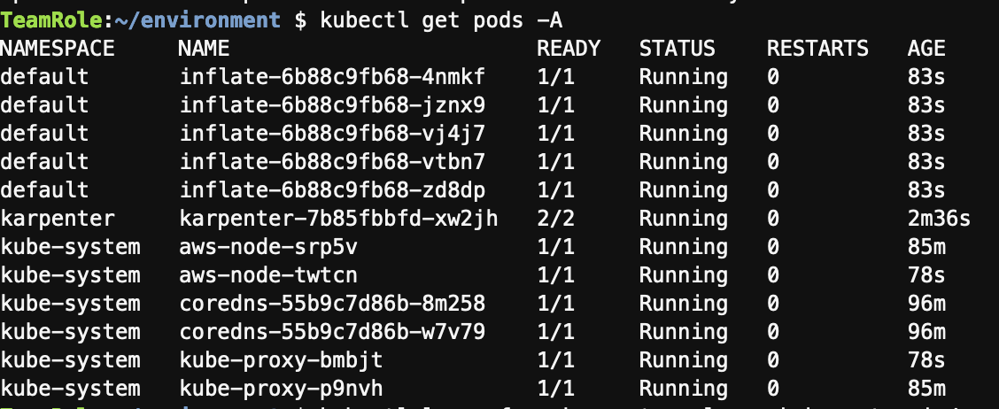

## 1.Install Helm and setup Karpenter.
* In the cloud9 terminal, run the command on terminal.
```bash
. eksworkshopguide/eks-karpenter.sh

```
[eks-karpenter.sh](eks-karpenter.sh)
* Install Helm and all the dependencies will take approximately 5 minutes

## 2.Deploy the test application and scale the deployment to check Karpenter status.
* Deploy a pause image and starts with zero replicas.
* Scale the deployment to 5.
* Check the karpenter status.
```bash
kubectl apply -f ~/environment/eksworkshopguide/yamls/karpenter-usage-1.yaml
kubectl scale deployment inflate --replicas 5
kubectl logs -f -n karpenter -l app.kubernetes.io/name=karpenter -c controller

```

* Check the pods status
```bash
kubectl get pods -A

```

* After the pods are running, scale the deployment relicas to 0.
```bash
kubectl scale deployment inflate --replicas 0

```
* You will see the added node was gone after 1 mins.
```bash
kubectl get nodes

```
