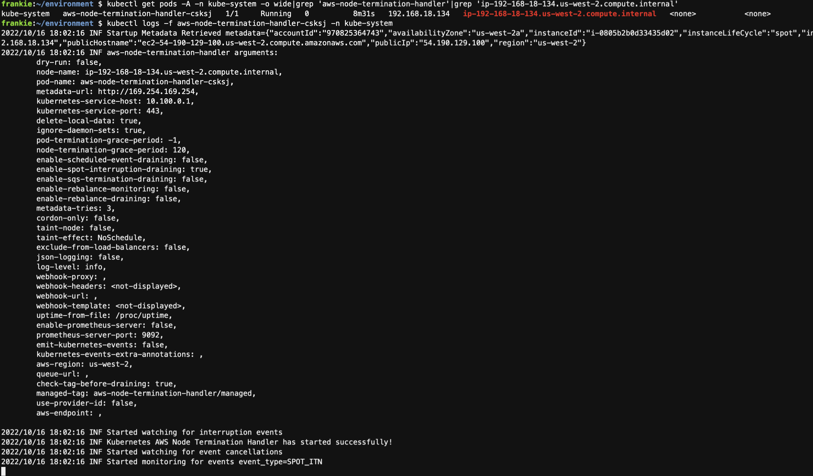
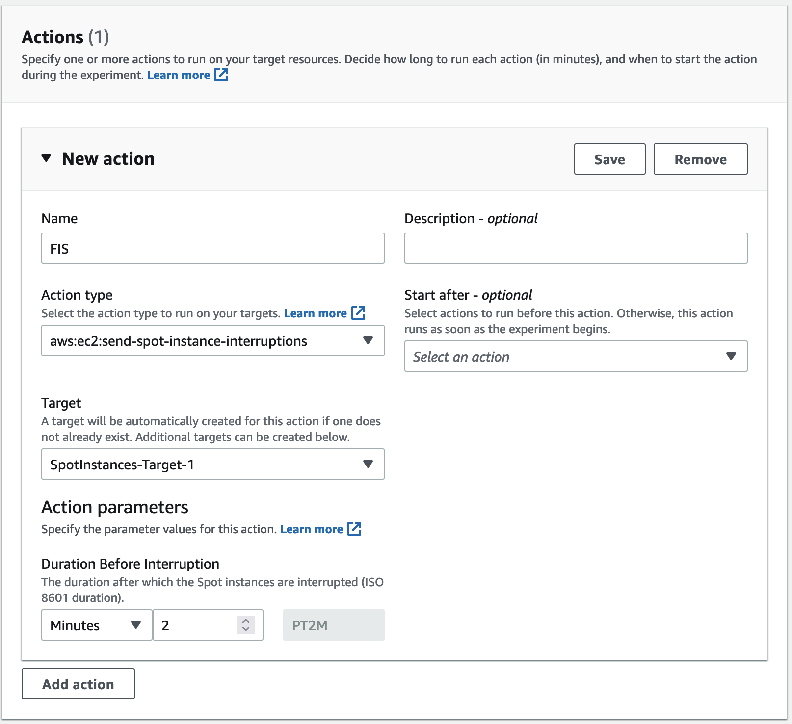
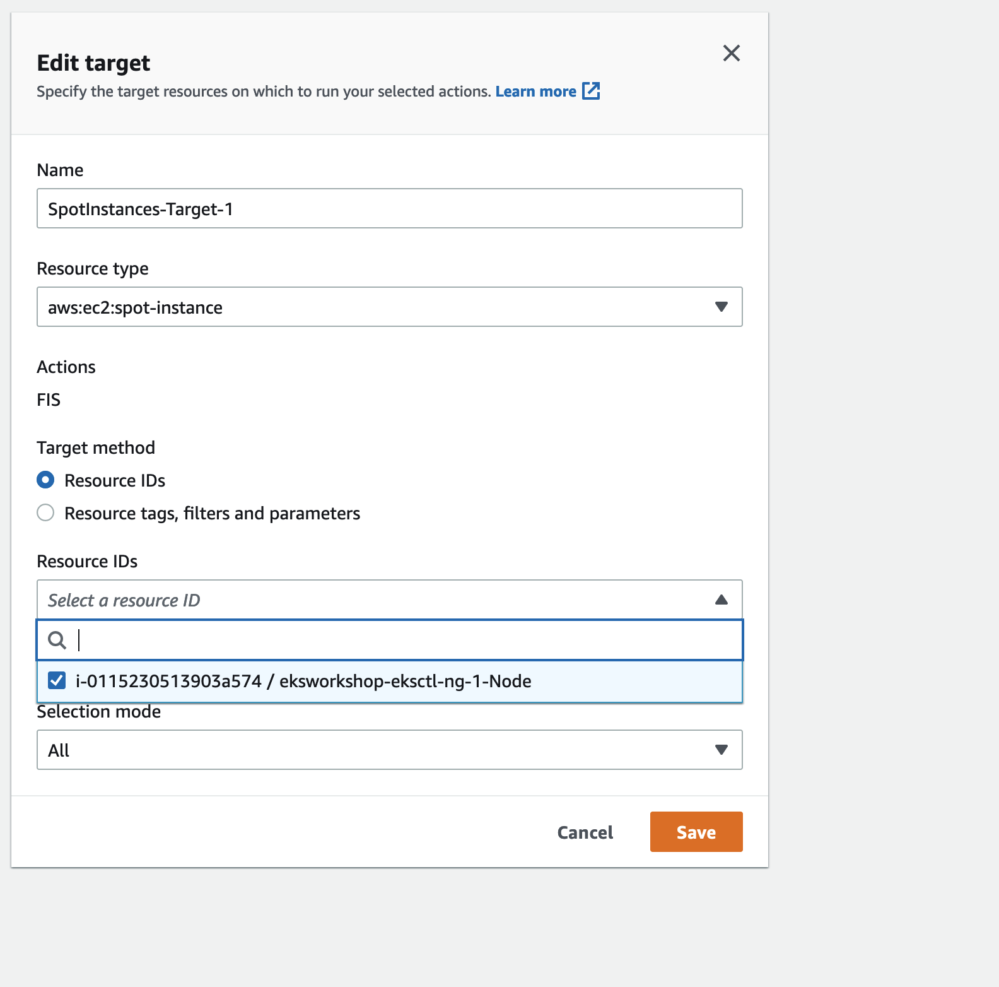
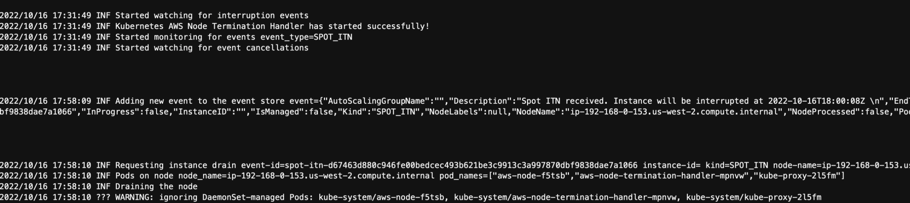

The aws-node-termination-handler (NTH) can operate in two different modes: Instance Metadata Service (IMDS) or the Queue Processor.

The aws-node-termination-handler Instance Metadata Service Monitor will run a small pod on each host to perform monitoring of IMDS paths like /spot or /events and react accordingly to drain and/or cordon the corresponding node.

The aws-node-termination-handler Queue Processor will monitor an SQS queue of events from Amazon EventBridge for ASG lifecycle events, EC2 status change events, Spot Interruption Termination Notice events, and Spot Rebalance Recommendation events. When NTH detects an instance is going down, we use the Kubernetes API to cordon the node to ensure no new work is scheduled there, then drain it, removing any existing work. The termination handler Queue Processor requires AWS IAM permissions to monitor and manage the SQS queue and to query the EC2 API.

In this section, we will use IMDS, and you can use the following link to see the detail.

https://github.com/aws/aws-node-termination-handler#installation-and-configuration-1

## 1.Install NTH
*Run the command.
```bash
. ~/environment/eksworkshopguide/eks-spot-node-interruption-handler-imds.sh
```
Then find the spot instance node.
```bash
kubectl get nodes -l node-lifecycle=spot
```
replace the instance, find the aws-node-termination-handler pod.
```bash
kubectl get pods -A -n kube-system -o wide|grep 'aws-node-termination-handler'|grep 'ip-192-168-18-134.us-west-2.compute.internal'
```
replace the pod id from the last step.
```bash
kubectl logs -f aws-node-termination-handler-csksj -n kube-system
```



## 2. create FIS in console.
* Open the AWS FIS console at https://console.aws.amazon.com/fis/.

* In the navigation pane, choose Experiment templates.

* Choose Create experiment template.

* Enter a description for the template.

* For IAM role, select the IAM role 'eksworkshop-fis-role'

* For Actions, do the following:

    Choose Add action.

    Enter a name for the action. For example, enter interruptSpotInstance.

    For Action type, choose aws:ec2:send-spot-instance-interruptions.

    For durationBeforeInterruption, specify 2 Minutes (PT2M).

    Choose Save.


* For Targets, do the following:

    Choose Edit for the target that AWS FIS automatically created for you in the previous step.

    Replace the default name with a more descriptive name. For example, enter oneSpotInstance.

    Verify that Resource type is aws:ec2:spot-instance.

    Choose all the spot instance.

    Choose Save.


* Choose Create experiment template. When prompted for confirmation, enter create and then choose Create experiment template.

* You should be on the details page for the experiment template that you just created. Otherwise, choose Experiment templates and then select the ID of the experiment template to open the details page.

* Choose Actions, Start.

* Choose Start experiment. When prompted for confirmation, enter start and choose Start experiment.

## 3. go to cloud9, see the pod name.
* The spot node is aleady cordoned

